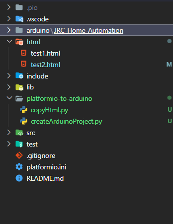

# PlatformIO to Arduino

- A python script to convert platformIO projects into arduino project.
- A helper script to convert html files into .h files ( in platformIO folder structure)

## Tutorial

- Clone the github repository in the root of the platformio project:

  ```bash
  git clone https://github.com/abrar-nazib/platformio-to-arduino
  ```

- For project conversion, run the `CreateArduinoProject.py` file:

  ```bash
  python createArduinoProject.py
  ```

  - It will create the arduino project inside `arduino/PROJECT_NAME/` directory

- For converting html file into .h file, run the `copyHtml.py file:
  ```bash
  python copyHtml.py
  ```
  - The html file has to be inside html folder

## Sample PlatformIO project structure


